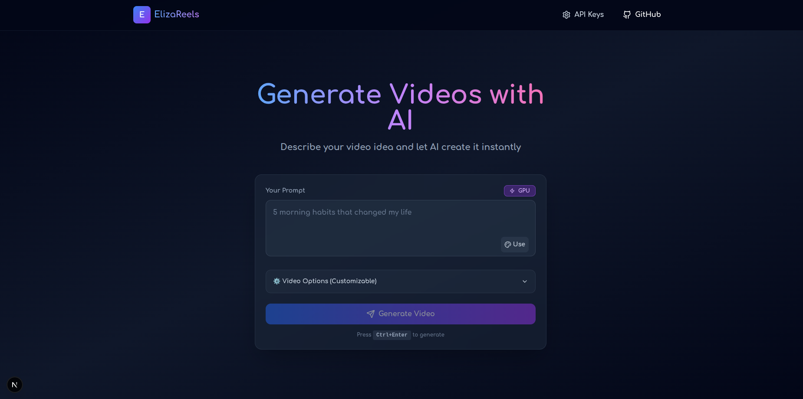

# 🎬 ElizaReels — AI Video Generator on Nosana GPU

> **ElizaOS + Nosana Agent Challenge Submission**  
> Decentralized AI video generation powered by ElizaOS intelligence and Nosana GPU infrastructure.



---

## 🌐 Live Deployment

| | Link |
|--|------|
| 🚀 **Live App (Nosana GPU)** | [https://4gQ9YfL6ehW9ehu4TTksXpLvgWYsWZt2jNjMbkTiEjAh.node.k8s.prd.nos.ci](https://4gQ9YfL6ehW9ehu4TTksXpLvgWYsWZt2jNjMbkTiEjAh.node.k8s.prd.nos.ci) |
| 🐦 **X (Twitter) Post** | [https://x.com/SOgunmusire/status/2043982233233490278](https://x.com/SOgunmusire/status/2043982233233490278) |
| 🐳 **Docker Image** | [docker.io/seyman101/aeterna:latest](https://hub.docker.com/r/seyman101/aeterna) |
| 💻 **GitHub Repo** | [Theideabased/agent-challenge](https://github.com/Theideabased/agent-challenge) |

> **Note on X/Superteam verification:** The X post for this submission is linked above.  
> I was unable to complete the X account verification on earn.superteam.fun due to a platform verification issue — the post exists and is public at the link above.

---

## 🏆 What Is ElizaReels?

**ElizaReels** is a full-stack AI video generation platform that combines the intelligence of an **ElizaOS agent** with the raw power of **Nosana's decentralized GPU network** to create high-quality, AI-narrated short-form videos — all from a single text prompt.

A user types a topic. The ElizaOS agent analyzes intent, extracts style, tone and keywords, then orchestrates a 6-phase pipeline that writes a script, generates voice, fetches visuals, adds subtitles, and composes the final MP4 — rendered on a Nosana GPU.

---

## ✅ Challenge Criteria

| Criterion | Weight | Implementation |
|-----------|--------|----------------|
| 🔧 Technical Implementation | 25% | FastAPI + Next.js, ElizaOS 6-phase pipeline, Python 3.12, type-safe services |
| 🖥️ Nosana Integration | 25% | Full GPU job submission, polling, Docker image deployed on Nosana |
| 🎯 Usefulness & UX | 25% | One-prompt video generation, real-time progress, HTML5 video player |
| 💡 Creativity & Originality | 15% | ElizaOS agent orchestration + decentralized GPU + AI video — unique combination |
| 📚 Documentation | 10% | This README + inline code docs + setup guide |

---

## 🚀 Quick Start

### Prerequisites
- Docker (recommended) **or** Node.js 20 + Python 3.12
- [Gemini API Key](https://ai.google.dev/) — free tier works
- [Pixabay API Key](https://pixabay.com/api/docs/) — free tier works

### Run with Docker (Recommended)

```bash
docker pull seyman101/aeterna:latest

docker run -p 3000:3000 -p 8080:8080 \
  -e GEMINI_API_KEY=your_gemini_key \
  -e PIXABAY_API_KEY=your_pixabay_key \
  seyman101/aeterna:latest
```

Then open **http://localhost:3000**

### Run Locally (Development)

**Backend:**
```bash
cd api
python -m venv .venv && source .venv/bin/activate
pip install -r requirements.txt
cp config.example.toml config.toml
# Edit config.toml → add your gemini_api_key and pixabay_api_keys
python main.py
```

**Frontend:**
```bash
cd frontend
npm install
echo "NEXT_PUBLIC_API_URL=http://localhost:8080/api/v1" > .env.local
npm run dev
```

Open **http://localhost:3000**

---

## 🎬 How It Works

```
User enters prompt
       ↓
┌─────────────────────────────────────────────┐
│           ElizaOS Agent Analysis            │
│  • Detect intent (motivational/education)   │
│  • Extract style, tone, keywords            │
│  • Estimate duration & complexity           │
│  • Generate style recommendations           │
└─────────────────────────────────────────────┘
       ↓
Phase 1 → 📝 Script generation (Gemini AI)
Phase 2 → 🎤 Voice synthesis (Azure TTS)
Phase 3 → 🎬 Video material fetch (Pixabay)
Phase 4 → 📸 Subtitle generation (Whisper)
Phase 5 → 🎨 Final video composition (MoviePy)
Phase 6 → ✅ MP4 ready for playback / download
```

All rendering runs on a **Nosana GPU node (RTX 3060)** via the decentralized job queue.

---

## 🏗️ Architecture

```
agent-challenge/
├── frontend/                  # Next.js 14 (standalone build)
│   ├── app/                   # App router pages
│   ├── components/            # VideoGeneratorHomepage, ApiKeysModal
│   └── lib/api.js             # Task polling, video URL extraction
│
├── api/                       # FastAPI Python backend
│   ├── main.py                # Entry point (port 8080)
│   ├── app/
│   │   ├── controllers/v1/    # video.py — generation + streaming
│   │   └── services/          # task.py, llm.py, voice.py,
│   │                          # video.py, subtitle.py, material.py
│   └── config.example.toml   # Configuration template
│
├── Dockerfile                 # Unified 2-stage build (Node + Python)
├── nos_job_def/               # Nosana job definition
└── assets/                    # Screenshots / media
```

---

## 🖥️ Nosana Deployment

This project ships as a **single Docker image** that runs both frontend and backend — optimized for Nosana's container GPU jobs.

### Job Definition

```json
{
  "ops": [{
    "id": "aeterna",
    "args": {
      "image": "seyman101/aeterna:latest",
      "expose": 3000,
      "env": {
        "GEMINI_API_KEY": "<your_key>",
        "PIXABAY_API_KEY": "<your_key>"
      },
      "resources": { "gpu": true }
    },
    "type": "container/run"
  }],
  "version": "0.1"
}
```

Full definition: [`nos_job_def/nosana_eliza_job_definition.json`](nos_job_def/nosana_eliza_job_definition.json)

### Build & Push

```bash
docker build -t seyman101/aeterna:latest .
docker push seyman101/aeterna:latest
```

---

## 🔑 Environment Variables

| Variable | Required | Description |
|----------|----------|-------------|
| `GEMINI_API_KEY` | ✅ Yes | Google Gemini AI — script generation |
| `PIXABAY_API_KEY` | ✅ Yes | Pixabay — free stock video material |

Both are injected into `config.toml` at container startup automatically.

---

## 📡 API Reference

### Generate Video
```http
POST /api/v1/videos
Content-Type: application/json

{
  "video_subject": "The power of discipline",
  "gemini_api_key": "...",
  "pixabay_api_key": "...",
  "video_language": "en",
  "voice_name": "en-US-AriaNeural"
}
```

### Poll Task Status
```http
GET /api/v1/tasks/{task_id}

Response:
{
  "state": 1,          // 1 = COMPLETED, 4 = PROCESSING, -1 = FAILED
  "progress": 100,
  "videos": ["http://host/api/v1/tasks/{id}/video/1"]
}
```

### Stream Video
```http
GET /api/v1/tasks/{task_id}/video/{index}
→ video/mp4 (supports HTTP range requests)
```

---

## 🛠️ Tech Stack

| Layer | Technology |
|-------|-----------|
| Frontend | Next.js 14, React, Tailwind CSS |
| Backend | FastAPI, Python 3.12, Uvicorn |
| AI / LLM | Google Gemini 2.0 Flash |
| Voice | Azure TTS (Neural voices) |
| Video | MoviePy, FFmpeg |
| Subtitles | OpenAI Whisper |
| Stock Media | Pixabay API |
| Agent Framework | ElizaOS |
| GPU Compute | Nosana (RTX 3060) |
| Container | Docker (2-stage build) |

---

## 📄 License

MIT — see [LICENSE](LICENSE)

---

## 🔗 Submission Links

| | Link |
|--|------|
| 🚀 **Live App (Nosana GPU)** | [https://4gQ9YfL6ehW9ehu4TTksXpLvgWYsWZt2jNjMbkTiEjAh.node.k8s.prd.nos.ci](https://4gQ9YfL6ehW9ehu4TTksXpLvgWYsWZt2jNjMbkTiEjAh.node.k8s.prd.nos.ci) |
| 🐦 **X (Twitter) Post** | [https://x.com/SOgunmusire/status/2043982233233490278](https://x.com/SOgunmusire/status/2043982233233490278) |
| 🐳 **Docker Image** | [docker.io/seyman101/aeterna:latest](https://hub.docker.com/r/seyman101/aeterna) |
| 💻 **GitHub Repo** | [Theideabased/agent-challenge](https://github.com/Theideabased/agent-challenge) |

---

<div align="center">

**Built for the Nosana × ElizaOS Agent Challenge**  
*Decentralized GPU • AI Agent Orchestration • One-Click Video Generation*

</div>
